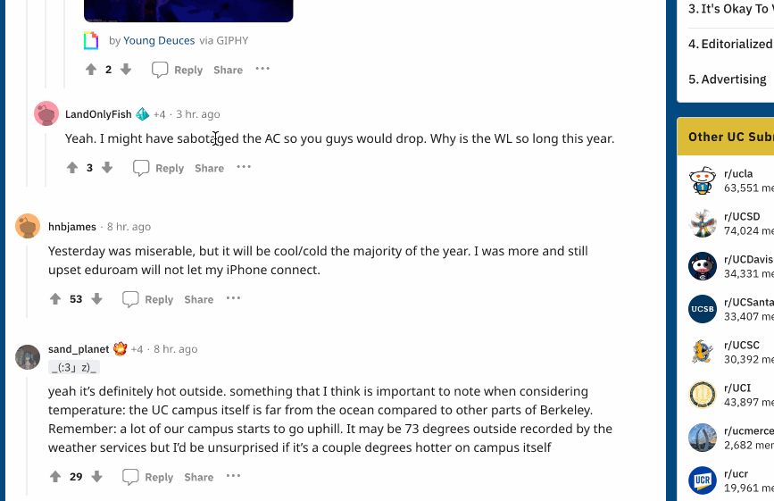

# 摘要
悬浮翻译/单词翻译/谷歌插件/Chrome插件/翻译插件/翻译工具/翻译小工具/翻译/英语学习/英语翻译/英语单词翻译/

# 这是什么
这是一款将英文单词转换为中文的小工具，可以用于翻译英文文档，或者用于英语学习。

# 怎么使用
## 翻译鼠标指向的单词
将鼠标指向单词，按下键`Win` 或者 `Option`，即可在鼠标附近显示翻译结果。

## 翻译句子
选中你要翻译的句子，按下键`Win` 或者 `Option`，即可在鼠标附近显示翻译结果。

# 可以自定义自己的翻译接口吗
可以，在代码中找到xhr请求的地方，修改为自己的翻译接口即可。

# 协议
本项目是开源项目，你可以自由使用，但是请保留作者信息，若想要增加新功能，可以联系作者付费定制。

# 效果图

